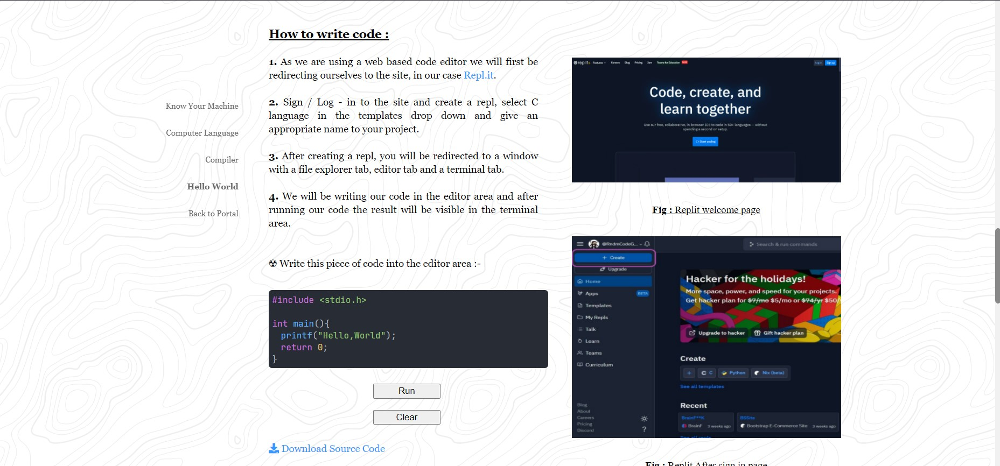

# C Tutorial Website

HTML, CSS, JS based website to teach young minds programming and C.

## Installation

Fork the repository

Clone the repository on your local machine
```
https://github.com/RndmCodeGuy20/Tutorial-Website.git
```
Move to the cloned repository
```
cd Tutorial-Website/
```

Use the node package manager (npm) to run the server.

```bash
npm start
```

## Images

## 



## Contributing

### 1. For Content Creators :

1. Fork and clone this repository on your local machine.
2. Head to ./Drafts directory and create a markdown file and write your content into it.
> Nomenclature for content file should be `Topic-<Your Name>`<br>
> 💀 Do not append your data directly into the `HTML` file.

### 2. For Developers :

1. Fork and clone this repository on your local machine.
2. Head to the file you want to contribute to, add features, insert content into markup, add or update tests or change src file to deploy the app.

Pull requests are welcome. For major changes, please open an issue first to discuss what you would like to change.

Please make sure to update tests as appropriate.

## License

[MIT](https://choosealicense.com/licenses/mit/)
